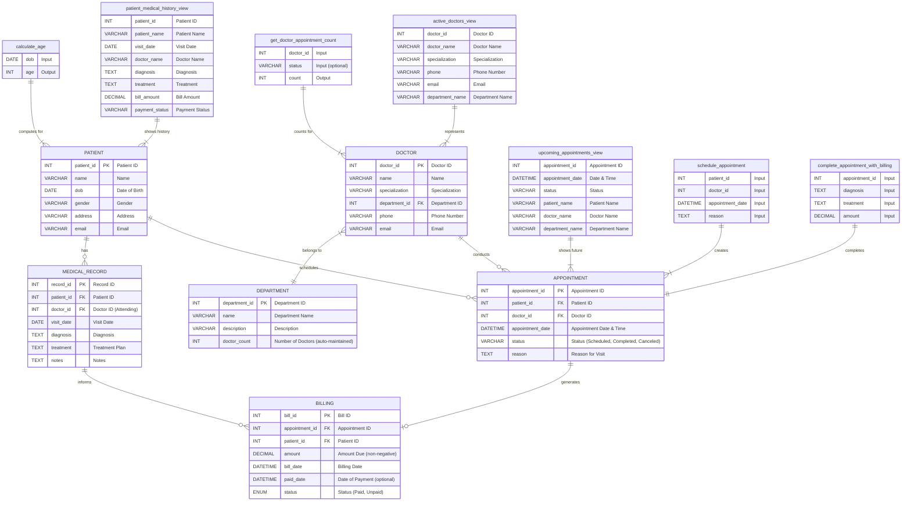

# Hospital Management System - ER Diagram

**Entities:**

*   **PATIENT:** Stores information about patients.
*   **DOCTOR:** Stores information about doctors.
*   **DEPARTMENT:** Stores information about hospital departments.
*   **APPOINTMENT:** Manages appointment scheduling between patients and doctors.
*   **MEDICAL\_RECORD:** Keeps track of patient visit details, diagnoses, and treatments.
*   **BILLING:** Handles billing information related to appointments.

**Relationships:**

*   A PATIENT can schedule multiple APPOINTMENTS.
*   A PATIENT has multiple MEDICAL\_RECORDS.
*   A DOCTOR conducts multiple APPOINTMENTS.
*   A DOCTOR belongs to one DEPARTMENT.
*   A DEPARTMENT employs multiple DOCTORS.
*   An APPOINTMENT generates one BILLING record.
*   A MEDICAL\_RECORD can inform BILLING (e.g., for procedures performed).

**Indexes:**

*   **Doctor:** idx_doctor_department (department_id)
*   **Appointment:** 
    * idx_appointment_patient (patient_id)
    * idx_appointment_doctor (doctor_id)
    * idx_appointment_date (appointment_date)
*   **Medical Record:**
    * idx_medical_record_patient (patient_id)
    * idx_medical_record_doctor (doctor_id)
    * idx_medical_record_date (visit_date)
*   **Billing:**
    * idx_billing_appointment (appointment_id)
    * idx_billing_patient (patient_id)
    * idx_billing_date (bill_date)
