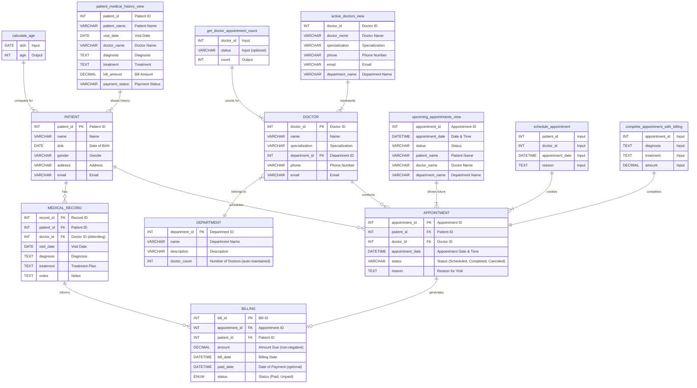

# 🏨 Hotel Management System

The **Hotel Management System** is a comprehensive application designed to streamline hotel operations, including **booking management**, **customer service**, and **database operations**.

---

## 🚀 Features

- Room Booking & Availability Tracking
- Customer Management
- Payment and Invoice Handling
- MySQL Database Integration

---

## 📦 Prerequisites

- [Anaconda / Miniconda](https://www.anaconda.com/docs/getting-started/anaconda/install) installed
- Python 3.10+
- MySQL Server

---

## ⚙️ Setup Instructions

### 1️⃣ Create and Activate Conda Environment

```
conda create --name hotel_management python=3.10
conda activate hotel_management
```

or Use 
```
python -m venv .venv
```
---

### 2️⃣ Install Dependencies

```
pip install -r requirements.txt
```

---

### 3️⃣ Configure Database Connection

Create a file named `db_config.py` in the root directory with the following content:

```
from pymysql.cursors import DictCursor

db_config = {
    "host": "your_host",
    "user": "your_user",
    "password": "your_password",
    "database": "your_database_name",
    "port": your_port,
    "charset": "utf8mb4",
    "cursorclass": DictCursor,
}
```

> Replace the placeholder values with your actual MySQL database details.

---

### 4️⃣ Create the Database Schema

Run the SQL commands in the `schema.sql` file using a MySQL client or terminal:

---

### 5️⃣ Run the Application

```
python app.py
```


# Hospital Management System - ER Diagram

